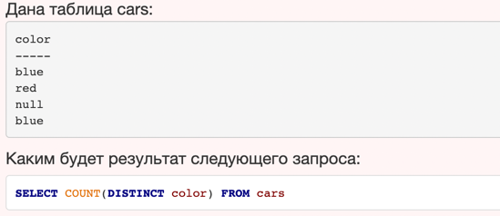

Полезные ссылки:

[SQL COMMANDS](https://www.codecademy.com/articles/sql-commands)
[Разгоняем бэкап. Лекция Яндекса](https://habr.com/ru/company/yandex/blog/415817/)
[Wal-g](https://habr.com/ru/post/486188/)
[MVCC-3. Версии строк](https://habr.com/ru/company/postgrespro/blog/445820/)
[MVCC-6. Очистка](https://habr.com/ru/company/postgrespro/blog/452320/)
[PostgreSQL: практические примеры оптимизации SQL-запросов](https://www.youtube.com/watch?v=dm_oid1HVfQ&ab_channel=HighLoadChannel)
[Влияние Transparent Huge Pages на производительность системы](https://habr.com/ru/company/tinkoff/blog/446342/)

1) Cвойства транзакций в PostgreSql

Этот набор свойств транзакций в базе данных должен гарантировать корректность операций при параллельном выполнении, а также в случае ошибок, при отключении питания и т. п.

    - Atomicity (Атомарность) - Свойство транзакции, которое заключается в том, что в результате транзакции все её операции выполняются вместе, либо не выполняются совсем. Кроме того, частичные изменения исключены в случае сбоя системы в процессе выполнения транзакции.

    - Consistency (Согласованность) - Свойство базы, суть которого в том, что данные базы всегда удовлетворяют ограничениям целостности. Транзакциям позволяется временно нарушать такие ограничения, но если к моменту завершения транзакции эти нарушения не устраняются, транзакция автоматически откатывается. 

    - Isolation (Изолированность) - Свойство, которое заключается в том, что результаты транзакции не видны для параллельных транзакций, пока она не будет зафиксирована. 
   
    - Durability (Надёжность) - Гарантия того, что после фиксирования транзакции произведённые ей изменения не будут потеряны даже в случае системной ошибки или краха сервера. Это одно из свойств ACID.

2) Уровни изоляций транзакций
   https://postgrespro.ru/docs/postgrespro/13/transaction-iso
   - Read Committed
   - Repeatable Read
   - Serializable
   
3) Аномалии в PostgreQql 
   - Неповторяемое чтение происходит, когда в ходе транзакции строка извлекается дважды, 
     а значения в строке различаются между операциями чтения.

   - Фантомное чтение происходит, когда в ходе транзакции выполняются два идентичных 
     запроса, а набор строк, возвращаемых вторым запросом, отличается от первого.

   - Аномалия сериализации - Результат успешной фиксации группы транзакций, выполняющихся 
     параллельно, не совпадает с результатом ни одного из возможных вариантов упорядочения этих 
     транзакций, если бы они выполнялись последовательно.

4) MVCC (Multiversion Concurrency Control, Многоверсионное управление конкурентным доступом))
https://postgrespro.ru/docs/postgrespro/9.5/mvcc-intro
Это означает, что каждый SQL-оператор видит снимок данных (версию базы данных) на определённый момент времени, вне зависимости от текущего состояния данных. Это защищает операторы от несогласованности данных, возможной, если другие конкурирующие транзакции внесут изменения в те же строки данных, и обеспечивает тем самым изоляцию транзакций для каждого сеанса баз данных. MVCC, отходя от методикблокирования, принятых в традиционных СУБД, снижает уровень конфликтов блокировок и таким образом обеспечивает более высокую производительность в многопользовательской среде.

столбцы xmin, xmax

Основное преимущество использования модели MVCC по сравнению с блокированием заключается в том, что блокировки MVCC, полученные для чтения данных, не конфликтуют с блокировками, полученными для записи, и поэтому чтение никогда не мешает записи, а запись чтению


5) VACUUM высвобождает пространство, занимаемое «мёртвыми» кортежами. 
https://postgrespro.ru/docs/postgrespro/9.5/sql-vacuum
При обычных операциях Postgres Pro кортежи, удалённые или устаревшие в результате обновления, физически не удаляются из таблицы; они сохраняются в ней, пока не будет выполнена команда VACUUM. Таким образом, периодически необходимо выполнять VACUUM, особенно для часто изменяемых таблиц.


6) Индексы
https://postgrespro.ru/docs/postgresql/9.6/indexes-types 
Cтруктура данных дефолтная для индекса - b-tree, какая сложность поиска в b-дереве (O(log n))
   
Плюсы и минусы индексов. У индексов есть несколько недостатков.
    a) Во-первых, они занимают пространство. Это может быть несущественным, но если ваша таблица особенно 
       велика, это может иметь значение.
    b) Во-вторых, что более важно, вам нужно помнить, что у индексов есть снижение производительности, 
       когда дело доходит до ВСТАВКИ новых строк, УДАЛЕНИЯ старых или ОБНОВЛЕНИЯ существующих значений 
       индексированного столбца, поскольку теперь оператор DML должен не только изменять данные 
       таблицы, но и индекс тоже один. Опять же, это во многом зависит от сценария использования 
       вашего приложения. Если DML настолько редки, что производительность не является проблемой, 
       это может не рассматриваться.
    c) В-третьих (хотя это тесно связано с моим первым пунктом), помните, что каждый раз, когда вы 
       создаете другой объект базы данных, вы создаете дополнительные накладные расходы на 
       обслуживание - это еще один индекс, который вам придется время от времени перестраивать, 
       собирать статистику для (в зависимости от СУБД вы, конечно, используете), другой объект, 
       чтобы грохотать словарь данных и т. д.

Суть в том, что все сводится к вашему варианту использования. Если у вас есть важные запросы, которые вы часто выполняете и которые можно улучшить с помощью этого индекса - дерзайте. Если вы запускаете этот запрос один раз в синюю луну, вы, вероятно, не захотите замедлять все ваши инструкции INSERT.

```postgresql
--типы индексов которые поддерживает ваша версия PG
select amname from pg_am;
```

7) Группы операторов языка Sql.
http://putham.com/post/2/What+is+DDL,+DML,+DCL+and+TCL+in+sql+,+oracle+,+postgresql
Язык SQL разделен на четыре типа операторов в зависимости от их функциональности: DDL, DML, DCL и TCL.
Язык определения DDL-данных
    DROP
    RENAME
    CREATE
    ALTER
DML-язык манипулирования данными
    SELECT
    UPDATE
    INSERT
    DELETE
DCL-язык управления данными
    GRANT
    REVOKE
TCL-язык управления транзакциями
    COMMIT
    ROLLBACK
    SAVEPOINT

8) Common Table Expressions, CTE
https://postgrespro.ru/docs/postgrespro/9.5/queries-with
   
9) Constraints
https://postgrespro.ru/docs/postgresql/9.5/ddl-constraints
Ограничения NOT NULL - product_no integer NOT NULL
Ограничения уникальности - product_no integer UNIQUE
Первичные ключи - product_no integer PRIMARY KEY Ограничение первичного ключа означает, что образующий его столбец или группа столбцов может быть уникальным идентификатором строк в таблице.
Внешние ключи - Ограничение внешнего ключа указывает, что значения столбца (или группы столбцов) должны соответствовать значениям в некоторой строке другой таблицы. Это называется ссылочной целостностью двух связанных таблиц.

10) Типы блокировок:
exclusive
shared lock
   
```postgresql
-- Данные по блокировкам
select * from pg_locks;

--пид процесса
select pg_backend_pid();
--получить список пидов которые залочили переданый пид
select pg_blocking_pids(123);
```

11) Может ли значение в столбце(ах), на который наложено ограничение foreign key, равняться null?
Может, если на данный столбец не наложено ограничение not null, пример: при построении таблицы дерева файловой системы, где столбец foreign key - ссылка на эту же самую таблицу, на кортеж с информацией о родительской директории, тогда для корневой директории файловой системы в столбце родительской директории будет - null.
   
12) задачка на запрос http://www.quizful.net/interview/sql/picks-of-tables



13) Какие отличия между ограничениями primary и unique?
Ограничения primary и unique призваны обеспечить уникальность значений столбца, на котором они определены. Но по умолчанию ограничение primary создает кластерный индекс на столбце, а unique - некластерный. Другим отличием является то, что primary не разрешает NULL записей, в то время как unique разрешает только одну NULL запись.
   
14) В чем отличие между кластерными индексами и некластерными?
Некластерные индексы создаются СУБД по умолчанию. Данные физически расположены в произвольном порядке, но логически упорядочены согласно индексу. Такой тип индексов подходит для таблиц, где часто изменяются значения.

При кластерном индексировании данные физически упорядочены, что серьезно повышает скорость выборок данных (но только в случае последовательного доступа к данным). Для одной таблицы может быть создан только один кластерный индекс.


PSQL commands
```shell
\set AUTOCOMMIT off
\echo :AUTOCOMMIT
```

### get curent transaction id
```shell
select txid_current();
```

```shell
SET TRANSACTION ISOLATION LEVEL REPEATABLE READ; 
```

```shell
VACUUM VERBOSE test;
```

